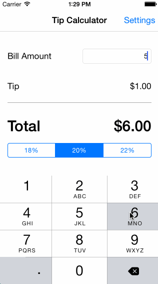

# TipCalculator
this makes some excellent tip calculations

Time spent: 3 hours spent in total

Completed user stories:

 * [x] Required: Followed video walkthrough (Swift version)
 * [x] Required: Augmented the tip calculator app with a settings view
 * [x] Optional: Added nav view controller to switch between pages, tweaked UI

GIF created with [LiceCap](http://www.cockos.com/licecap/).
